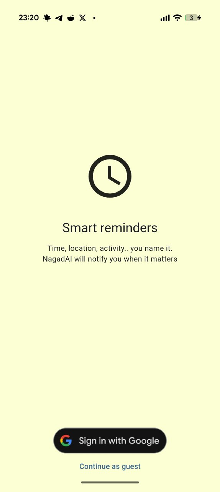
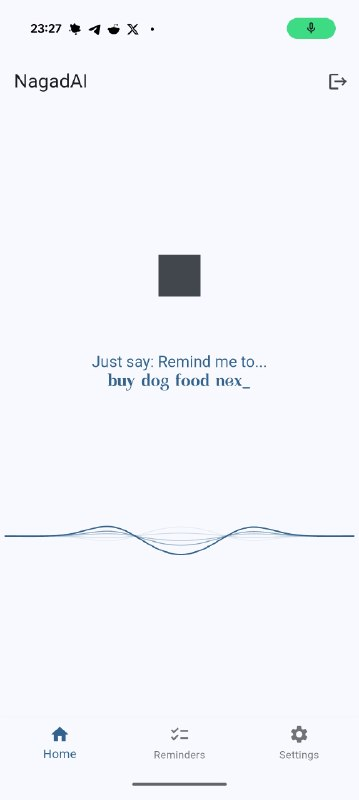
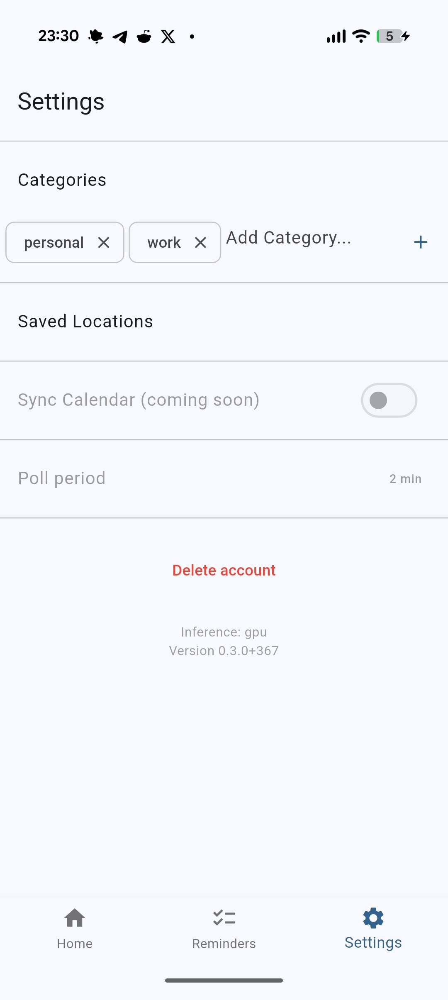
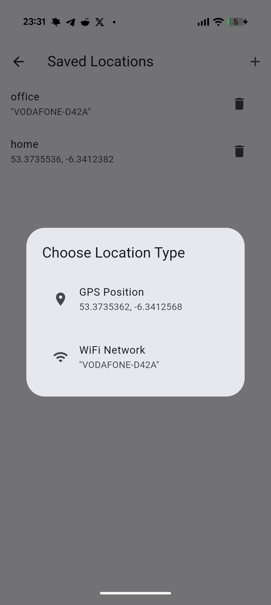

# NagadAI

Flutter mobile application for smart context-aware reminders using Gemma 4 on the edge device.

## Install

App has been published in Google Play for closed testing.

To get to the app, your email needs to be added to the list of testers. Email me at nagadai@chaplyk.com to be added to the list.

## Screenshots

| Login | Home | Settings | Locations |
|---|---|---|---|
|  |  |  | 
